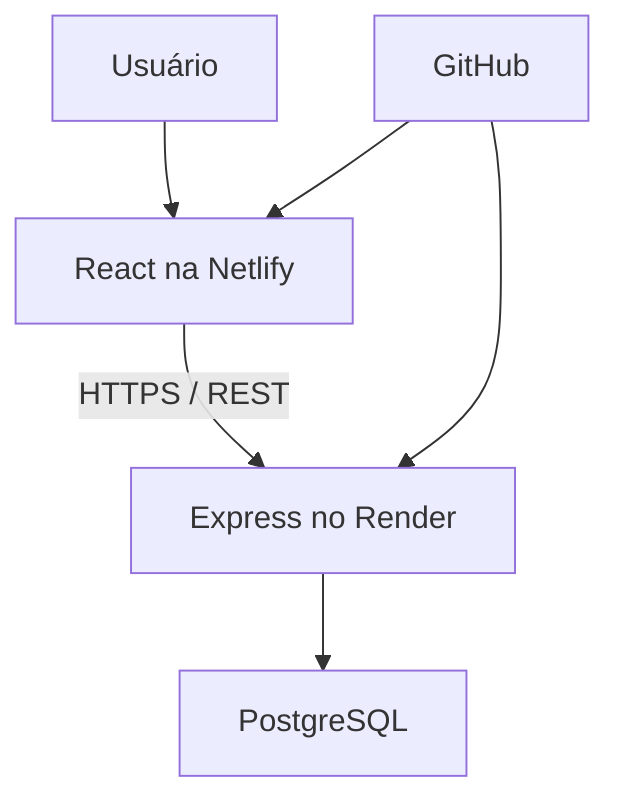

# Heraia

**Projeto escolar fictício de Educação Física sobre desigualdade de gênero na sociedade.**

O Heraia propõe incentivar a participação de meninas e mulheres no esporte por meio de educação desde a infância, divulgação de oportunidades e valorização de atletas e equipes. O nome se inspira nos Jogos Heraicos da Grécia Antiga.

Todos os eventos, locais e personagens incluídos são fictícios e identificados na interface. Não há parceiros, patrocínios, inscrições reais ou resultados anunciados. Para testar o formulário, use informações fictícias.

## O que está implementado

- React, TypeScript, Vite e Tailwind CSS, com estilos próprios.
- Interface responsiva, navegação mobile, foco visível, labels, HTML semântico e respeito à preferência por movimento reduzido.
- Home, apresentação do projeto, 12 modalidades, calendário, filtros por modalidade/cidade/estado/data/categoria, detalhes de eventos e histórias.
- Conteúdo carregado pela API Express; estados de carregamento, erro, ausência de resultados e confirmação.
- Formulário validado pelo navegador e pelo servidor.
- API com PostgreSQL, esquema e dados demonstrativos para importação.
- Modo local de demonstração em memória, sem banco obrigatório.
- Login administrativo, consulta de solicitações, e CRUD de eventos e histórias pela API, protegidos por JWT.
- Validação Zod, consultas parametrizadas, CORS com lista de origens, Helmet, limite de tamanho de requisição, rate limiting e erros centralizados.

## Limites e propostas futuras

As oficinas nas escolas, parcerias e oportunidades de patrocínio são propostas, não serviços em operação. O painel visual administrativo exibe solicitações; a edição de eventos e histórias é feita pela API. Um editor visual, cadastro de equipes, recuperação de senha, múltiplas contas administrativas, imagens editoriais e inscrições externas verificadas podem ser desenvolvidos depois.

No modo `demo`, alterações e solicitações ficam **somente na memória do servidor**, desaparecendo no reinício. A confirmação diz explicitamente que o envio foi simulado. No modo `postgres`, as solicitações persistem, mas não geram e-mails nem contato real. Não há fallback silencioso: se a API não estiver disponível, a interface mostra erro e oferece nova tentativa.

O build dos dois projetos e os testes de integração da API passaram. Não foi realizada inspeção visual em navegador nem execução das migrações em um PostgreSQL real neste ambiente. O código foi preparado para Netlify e Render. Não foi publicado nesses serviços, conectado a um banco real ou enviado a um repositório GitHub nesta entrega. Não há credenciais incluídas. Antes de receber dados pessoais reais, o projeto exige política de privacidade, processo de retenção/remoção e avaliação operacional adequada.

## Arquitetura



O frontend e o backend podem ser implantados separadamente. O frontend centraliza as chamadas em `frontend/src/services/api.ts`. O backend utiliza `backend/src/database/store.ts` para acessar o PostgreSQL ou os dados locais da demonstração.

## Instalação e execução local

Requisitos: Node.js 22 ou superior e npm. Para persistência, um PostgreSQL acessível.

Na pasta raiz:

```bash
npm ci
cp backend/.env.example backend/.env
cp frontend/.env.example frontend/.env
```

Primeiro terminal:

```bash
npm run dev:backend
```

Segundo terminal:

```bash
npm run dev:frontend
```

Abra o endereço indicado pelo Vite, normalmente `http://localhost:5173`. O proxy local encaminha `/api` para `http://127.0.0.1:3001`. O backend carrega `.env` da pasta `backend`, porque os comandos dos workspaces executam nessa pasta.

```bash
npm run build
npm run check
npm test
```

`npm test` verifica eventos, filtros, erros 400/404, confirmação de participação, bloqueio de acesso sem autenticação, login e criação/edição/remoção administrativas. O build verifica o TypeScript dos dois projetos.

## Variáveis do frontend

| Variável | Descrição |
| --- | --- |
| `VITE_API_URL` | Base pública da API, incluindo `/api`. Local: `/api`; hospedado: `https://SEU-BACKEND.onrender.com/api`. |

Variáveis `VITE_` ficam visíveis no código entregue ao navegador. Nunca inclua segredos nelas. Altere a variável e faça novo build quando mudar a API.

## Variáveis do backend

| Variável | Descrição |
| --- | --- |
| `PORT` | Porta HTTP; localmente 3001. O serviço de hospedagem pode fornecê-la. |
| `DATA_MODE` | `demo` para memória local; `postgres` para persistência. |
| `DATABASE_URL` | URL de conexão PostgreSQL, somente no backend. |
| `DATABASE_SSL` | `true` para conexão TLS com validação do certificado; `false` para ambiente local sem TLS. |
| `CORS_ORIGIN` | Origens exatas permitidas, separadas por vírgula, sem barra final. |
| `JWT_SECRET` | Segredo aleatório de pelo menos 32 caracteres para habilitar o login. |
| `ADMIN_EMAIL` | E-mail da única conta administrativa configurada. |
| `ADMIN_PASSWORD_HASH` | Hash bcrypt da senha administrativa; nunca a senha em texto puro. |
| `NODE_ENV` | `development` local; `production` na hospedagem. |
| `TRUST_PROXY` | Quantidade de proxies confiáveis: 0 local; configure conforme a infraestrutura. |

A inicialização em `NODE_ENV=production` exige `DATA_MODE=postgres` e `DATABASE_URL`. Não use memória para dados de produção. O rate limiting desta versão usa memória de uma instância; implantações com várias instâncias precisarão de um armazenamento compartilhado.

Gere um segredo:

```bash
node -e "console.log(require('node:crypto').randomBytes(48).toString('hex'))"
```

Para gerar um hash sem gravar a senha no código ou no histórico do shell, execute na raiz, em um terminal interativo:

```bash
npm run hash-password --workspace backend
```

Digite uma senha de pelo menos 12 caracteres e copie o hash gerado para `ADMIN_PASSWORD_HASH` no ambiente do backend.

Alternativamente, gere o hash com uma ferramenta local confiável. O JWT expira em uma hora e fica apenas na memória da página, sem armazenamento persistente no navegador. O logout apaga o token da interface; revogação imediata de tokens no servidor não está implementada.

## PostgreSQL

Configure `DATA_MODE=postgres`, `DATABASE_URL` e, quando necessário, `DATABASE_SSL=true` em `backend/.env`.

```bash
npm run db:migrate --workspace backend
npm run db:seed --workspace backend
```

O esquema cria `sports`, `events`, `athlete_stories` e `participation_requests`. A tabela de eventos acrescenta `state` e `is_demo` para os filtros e a identificação de ficção. O seed é repetível: não sobrescreve registros com IDs já existentes. A migração inicial é repetível, mas não constitui um sistema de migrações versionadas para alterações futuras.

Os campos `image_url` estão preparados no banco; a interface atual usa composição tipográfica e iniciais das personagens, sem fotografias ou imagens externas. Os eventos demonstrativos não têm links de inscrição.

## API REST

| Método e caminho | Acesso | Função |
| --- | --- | --- |
| `GET /api/health` | Público | Estado, modo e persistência; testa o banco quando habilitado. |
| `GET /api/events` | Público | Lista ordenada; aceita `sport`, `city`, `state`, `date`, `category`. |
| `GET /api/events/:id` | Público | Detalhes do evento. |
| `GET /api/sports` | Público | Modalidades. |
| `GET /api/sports/:id` | Público | Detalhes de modalidade. |
| `GET /api/stories` | Público | Histórias fictícias. |
| `GET /api/stories/:id` | Público | Detalhes de história. |
| `POST /api/participation` | Público, com rate limit | Recebe nome, e-mail, tipo, cidade e mensagem. |
| `POST /api/admin/login` | Público, com rate limit | Valida e-mail/senha e retorna JWT. |
| `GET /api/admin/participation` | Administrativo | Lista solicitações. |
| `POST /api/events` | Administrativo | Cria evento. |
| `PUT /api/events/:id` | Administrativo | Substitui os campos do evento. |
| `DELETE /api/events/:id` | Administrativo | Remove evento. |
| `POST /api/stories` | Administrativo | Cria história. |
| `PUT /api/stories/:id` | Administrativo | Substitui os campos da história. |
| `DELETE /api/stories/:id` | Administrativo | Remove história. |

Envie `Authorization: Bearer TOKEN` nas chamadas administrativas. Não há usuário ou senha padrão. Sem configuração de autenticação, o login retorna 503 e as rotas restritas continuam bloqueadas.

`date` no filtro significa **a partir da data**, em formato `YYYY-MM-DD`. Tipos de participação aceitos: `Estudante/atleta`, `Escola`, `Equipe`, `Apoio`. Mensagem: de 10 a 2000 caracteres. O backend aceita texto simples, não HTML.

Respostas: 200 sucesso, 201 criação, 204 remoção, 400 validação/JSON inválido, 401 autenticação, 404 ausência, 413 corpo muito grande, 429 rate limit, 500 erro interno e 503 administração não configurada. As respostas de erro não expõem stack traces.

## Preparação para GitHub e Netlify

1. Crie seu repositório e envie o conteúdo de `heraia`, incluindo `package-lock.json`, mas nunca `.env` ou `node_modules`.
2. Importe o repositório na Netlify.
3. Configure a pasta base `frontend`, comando `npm run build`, diretório de publicação `dist` e Node.js 22.
4. Configure `VITE_API_URL=https://SEU-BACKEND.onrender.com/api`.
5. O arquivo `frontend/netlify.toml` configura o fallback de rotas para `index.html`, necessário para abrir links de detalhes diretamente.
6. Faça o build e verifique páginas, filtros e formulário após conectar a API.

## Preparação para Render

1. Crie o PostgreSQL e um serviço web Node.js conectado ao repositório.
2. Configure a pasta raiz `backend`, build `npm ci --include=dev && npm run build`, início `npm start` e Node.js 22.
3. Configure `NODE_ENV=production`, `DATA_MODE=postgres`, `DATABASE_URL` e as demais variáveis pertinentes. O Render fornece a porta pelo ambiente.
4. Configure `CORS_ORIGIN` com a origem HTTPS exata do frontend, e `TRUST_PROXY` de acordo com o proxy confiável da implantação.
5. Execute `npm run db:migrate` e `npm run db:seed` no contexto do backend **antes** de disponibilizar os dados. Pode usar uma etapa de pré-deploy se seu plano suportar, ou executar localmente com a conexão autorizada ao banco.
6. Configure `/api/health` para verificar a saúde do serviço e teste a integração pelo frontend.

O monorepo mantém um lockfile na raiz. Se a hospedagem não localizar o lockfile ao usar uma subpasta, use a raiz do repositório para instalação: build backend `npm ci --include=dev && npm run build --workspace backend` e início `npm run start --workspace backend`; frontend `npm ci --include=dev && npm run build --workspace frontend`, publicação `frontend/dist`. Nesse caso, copie a regra de fallback do `frontend/netlify.toml` para a configuração raiz da Netlify.

## Estrutura

```text
heraia/
  frontend/
    public/favicon.svg
    src/
      main.tsx                 páginas, navegação e componentes
      style.css                identidade visual e responsividade
      services/api.ts          requisições e tipos
    .env.example
    netlify.toml
    vite.config.ts
    package.json
  backend/
    src/
      app.ts                   rotas, validação e erros
      server.ts                servidor HTTP
      middleware/auth.ts       proteção JWT
      database/
        demo.ts                dados fictícios
        store.ts               PostgreSQL ou memória local
        schema.sql             esquema
        migrate.ts             migração inicial
        seed.ts                importação demonstrativa
      api.test.ts              integração da API
    .env.example
    package.json
  package.json
  package-lock.json
  .gitignore
  README.md
```

A estrutura foi compactada para facilitar o uso escolar. Separar controllers, páginas e serviços adicionais é uma evolução possível conforme o projeto crescer.
